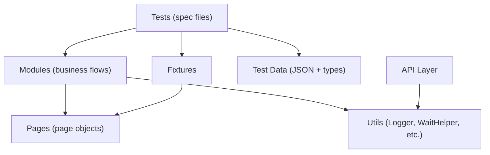

# 🔍 Advanced Playwright Framework — Codebase Analysis & Improvements

> Full analysis of `PramodDutta/Advance-Playwright-Framework` with 18 actionable improvement points, ranked by long-term impact.

---

## Architecture Overview

The framework follows a solid **3-layer architecture**:



**Strengths already in place:** Page Object Model, Module pattern separating business logic from raw page interactions, typed test data, custom reporter, barrel exports, Docker + CI pipelines, ESLint/Prettier/Husky toolchain, custom rule engine.

---

## Improvement Points

### 1. 🔴 `.env` File Committed to Version Control — Secrets Leak Risk

| Aspect | Detail |
|--------|--------|
| **File** | [.env](file:///d:/Advanced-Playwright-Framework/Advance-Playwright-Framework/.env) |
| **Issue** | The `.env` file contains `TEST_PASSWORD=SecurePass123` and is **not** in `.gitignore` |
| **Risk** | Credentials end up in Git history forever; anyone who clones the repo gets them |

**Why this matters long-term:** Even if these are "test" credentials today, teams eventually add staging/production secrets to `.env` files by habit. Once a password leaks into Git history, it requires a full `git filter-repo` to remove.

**Fix:**
```diff
# .gitignore — add:
+.env
+.env.*
+!.env.example
```
Create a `.env.example` with placeholder values for documentation.

---

### 2. 🔴 Hardcoded Credentials in `config/index.ts` and `testdata/users.json`

| Aspect | Detail |
|--------|--------|
| **Files** | [config/index.ts](file:///d:/Advanced-Playwright-Framework/Advance-Playwright-Framework/src/config/index.ts#L39-L42), [users.json](file:///d:/Advanced-Playwright-Framework/Advance-Playwright-Framework/src/testdata/users.json#L6-L7) |
| **Issue** | Passwords like `SecurePass123`, `AdminPass456`, `PremiumPass789` are hardcoded in plain text |
| **Risk** | Credential exposure in public repos; no separation between environments |

**Why this matters long-term:** As the team grows and multiple environments (staging, UAT, production-like) are added, hardcoded credentials become impossible to manage securely. Different team members need different credentials.

**Fix:** Move all passwords to environment variables or a secrets manager. Use `users.json` only for structural data (usernames, roles), and inject passwords via env vars at runtime:
```typescript
// config/index.ts
testUser: {
    username: process.env.TEST_USERNAME || '',
    password: process.env.TEST_PASSWORD || '',
},
```

---

### 3. 🔴 Dockerfile and Jenkinsfile Use Stale Playwright Version

| Aspect | Detail |
|--------|--------|
| **Files** | [Dockerfile:9](file:///d:/Advanced-Playwright-Framework/Advance-Playwright-Framework/Dockerfile#L9), [Jenkinsfile:16](file:///d:/Advanced-Playwright-Framework/Advance-Playwright-Framework/Jenkinsfile#L16) |
| **Issue** | Image pinned to `v1.40.0-jammy`, while `package.json` declares `@playwright/test: ^1.57.0` |
| **Risk** | Browser/Playwright mismatch causing cryptic CI failures |

**Why this matters long-term:** Playwright requires exact version alignment between the npm package and its browser binaries. A `v1.40.0` Docker image does NOT contain browsers compatible with the `v1.57.x` API. Tests will crash in Docker/Jenkins with `browserType.launch: Executable doesn't exist` errors.

**Fix:** Sync the Docker image version with `package.json`:
```dockerfile
FROM mcr.microsoft.com/playwright:v1.57.0-jammy
```
Better yet, use a build arg to make it parameterized:
```dockerfile
ARG PLAYWRIGHT_VERSION=1.57.0
FROM mcr.microsoft.com/playwright:v${PLAYWRIGHT_VERSION}-jammy
```

---

### 4. 🟡 Tests Silently Skip When Test Data Is Missing — No Assertions, No Failure

| Aspect | Detail |
|--------|--------|
| **Files** | [login.spec.ts:61-63](file:///d:/Advanced-Playwright-Framework/Advance-Playwright-Framework/src/tests/login.spec.ts#L61-L63), [product.spec.ts:61-63](file:///d:/Advanced-Playwright-Framework/Advance-Playwright-Framework/src/tests/product.spec.ts#L61-L63), [checkout.spec.ts:99-101](file:///d:/Advanced-Playwright-Framework/Advance-Playwright-Framework/src/tests/checkout.spec.ts#L99-L101) |
| **Issue** | Pattern: `if (!data) { return; }` — tests exit with a **pass** status when data is missing |
| **Risk** | Gives false confidence; regression bugs go undetected |

**Why this matters long-term:** When someone removes a test data entry, the test silently passes instead of alerting. Over months, you can end up with a suite where 30% of tests are effectively no-ops, but the dashboard shows 100% pass rate.

**Fix:** Use `test.skip()` or `test.fail()` to make intent explicit:
```typescript
const emptyUsername = invalidUsers.find((u) => u.username === '');
test.skip(!emptyUsername, 'No empty-username test data entry found');

const errorMessage = await loginModule.attemptInvalidLogin(
    emptyUsername!.username,
    emptyUsername!.password,
);
expect(errorMessage).toContain(emptyUsername!.expectedError);
```

---

### 5. 🟡 `tta-sample.spec.ts` Has Fake Assertions and Anti-Patterns

| Aspect | Detail |
|--------|--------|
| **File** | [tta-sample.spec.ts](file:///d:/Advanced-Playwright-Framework/Advance-Playwright-Framework/src/tests/tta-sample.spec.ts) |
| **Issues** | Multiple problems: |

| Line(s) | Problem |
|---------|---------|
| [52](file:///d:/Advanced-Playwright-Framework/Advance-Playwright-Framework/src/tests/tta-sample.spec.ts#L52) | `expect(true).toBeTruthy()` — always passes, asserts nothing |
| [73](file:///d:/Advanced-Playwright-Framework/Advance-Playwright-Framework/src/tests/tta-sample.spec.ts#L73) | `expect(true).toBeTruthy()` — same fake assertion |
| [125](file:///d:/Advanced-Playwright-Framework/Advance-Playwright-Framework/src/tests/tta-sample.spec.ts#L125) | `expect(true).toBeTruthy()` — meaningless assertion again |
| [38](file:///d:/Advanced-Playwright-Framework/Advance-Playwright-Framework/src/tests/tta-sample.spec.ts#L38) | `waitForLoadState('networkidle')` — Playwright docs explicitly [discourage this](https://playwright.dev/docs/api/class-page#page-wait-for-load-state) |
| [81,87,93,138](file:///d:/Advanced-Playwright-Framework/Advance-Playwright-Framework/src/tests/tta-sample.spec.ts#L81) | `waitForTimeout(500)` — hardcoded waits make tests slow and flaky |
| [8](file:///d:/Advanced-Playwright-Framework/Advance-Playwright-Framework/src/tests/tta-sample.spec.ts#L8) | Imports from `@playwright/test` directly instead of custom `../fixtures` |
| [20,27,39,…](file:///d:/Advanced-Playwright-Framework/Advance-Playwright-Framework/src/tests/tta-sample.spec.ts#L20) | Excessive `console.log` statements (ESLint rule `no-console` is set to warn) |

**Why this matters long-term:** This file is a "sample/demo" that new contributors will copy as a template. Bad patterns here will proliferate across the entire test suite.

**Fix:** Either remove it or rewrite it with real assertions and proper waits. Use `expect(nav).toBeVisible()` instead of `expect(true).toBeTruthy()`.

---

### 6. 🟡 Duplicated Authentication Logic Across 3 Places

| Aspect | Detail |
|--------|--------|
| **Files** | [fixtures/index.ts:80-93](file:///d:/Advanced-Playwright-Framework/Advance-Playwright-Framework/src/fixtures/index.ts#L80-L93), [auth.fixture.ts:17-35](file:///d:/Advanced-Playwright-Framework/Advance-Playwright-Framework/src/fixtures/auth.fixture.ts#L17-L35), [auth.fixture.ts:41-57](file:///d:/Advanced-Playwright-Framework/Advance-Playwright-Framework/src/fixtures/auth.fixture.ts#L41-L57) |
| **Issue** | The login flow (navigate → enter username → enter password → click → waitForURL) is copy-pasted 3+ times |
| **Risk** | If the login flow changes (e.g., adding a CAPTCHA step), you must update N places |

**Why this matters long-term:** DRY violations in test infrastructure are the #1 cause of flaky test suites. When the login page adds 2FA, you'll forget one of the three copy-pasted locations and spend hours debugging.

**Fix:** Consolidate into a single `performLogin(page, username, password)` helper, or reuse `LoginModule.doLogin()` in all fixtures:
```typescript
authenticatedPage: async ({ browser }, use) => {
    const context = await browser.newContext();
    const page = await context.newPage();
    const loginModule = new LoginModule(page);
    await loginModule.doLogin(config.testUser.username, config.testUser.password);
    await use(page);
    await context.close();
},
```

---

### 7. 🟡 `authenticatedPage` Fixture Doesn't Use `storageState` — Slow Re-Login Per Test

| Aspect | Detail |
|--------|--------|
| **Files** | [fixtures/index.ts:80-93](file:///d:/Advanced-Playwright-Framework/Advance-Playwright-Framework/src/fixtures/index.ts#L80-L93) |
| **Issue** | Every test using `authenticatedPage` performs a full UI login (navigate + fill + click + wait) |
| **Risk** | Slow test execution as suite grows; 1-2 seconds per login × 100 tests = minutes wasted |

**Why this matters long-term:** Playwright's [recommended approach](https://playwright.dev/docs/auth) uses `storageState` to capture auth cookies/tokens once and reuse them. The `auth.fixture.ts` already saves `storageState` but the primary `authenticatedPage` fixture in `fixtures/index.ts` doesn't use it.

**Fix:** Use Playwright's [global setup](https://playwright.dev/docs/auth#basic-shared-account-in-all-tests) with `storageState`:
```typescript
// global-setup.ts
async function globalSetup() {
    const browser = await chromium.launch();
    const page = await browser.newPage();
    const loginModule = new LoginModule(page);
    await loginModule.doLogin(config.testUser.username, config.testUser.password);
    await page.context().storageState({ path: '.auth/user.json' });
    await browser.close();
}
```

---

### 8. 🟡 Path Aliases (`@pages/*`, `@utils/*`) Aren't Resolved at Runtime

| Aspect | Detail |
|--------|--------|
| **File** | [tsconfig.json](file:///d:/Advanced-Playwright-Framework/Advance-Playwright-Framework/tsconfig.json#L13-L20) |
| **Issue** | `paths` aliases are defined (`@pages/*`, `@modules/*`, etc.) but never actually used anywhere in the code. All imports use relative paths (`../pages/`, `../utils/`). Additionally, `tsconfig` `paths` only work at compile time — without a runtime resolver (e.g., `tsconfig-paths` or `module-alias`), they'd fail anyway. |
| **Risk** | Dead configuration that confuses contributors |

**Why this matters long-term:** New developers see the aliases, try to use them, and get runtime errors. Either fully implement them (add `tsconfig-paths` to the project) or remove the dead config.

**Fix:** Either:
- **Option A:** Install `tsconfig-paths` and use aliases everywhere consistently
- **Option B:** Remove the `paths` block from `tsconfig.json` to avoid confusion

---

### 9. 🟡 Missing ESLint / Prettier / Husky Dev Dependencies

| Aspect | Detail |
|--------|--------|
| **File** | [package.json](file:///d:/Advanced-Playwright-Framework/Advance-Playwright-Framework/package.json#L41-L46) |
| **Issue** | `devDependencies` lists only 4 packages (`@playwright/test`, `@types/node`, `dotenv`, `typescript`), but `.eslintrc.json` references `@typescript-eslint/parser`, `plugin:playwright/recommended`, `prettier` — none of which are installed |
| **Risk** | `npm run lint` and `npm run format` will crash with `Cannot find module` |

**Why this matters long-term:** CI pipelines will silently skip linting (the Jenkinsfile already uses `|| true` to suppress failures), meaning code quality rules are never actually enforced.

**Fix:** Add the missing dev dependencies:
```bash
npm install --save-dev \
  eslint \
  @typescript-eslint/eslint-plugin \
  @typescript-eslint/parser \
  eslint-plugin-playwright \
  eslint-config-prettier \
  prettier \
  husky \
  lint-staged \
  @commitlint/cli \
  @commitlint/config-conventional
```

---

### 10. 🟡 `WaitHelper` Reinvents Playwright's Built-in Auto-Wait

| Aspect | Detail |
|--------|--------|
| **File** | [WaitHelper.ts](file:///d:/Advanced-Playwright-Framework/Advance-Playwright-Framework/src/utils/WaitHelper.ts) |
| **Issue** | Methods like `waitForTextContains`, `waitForTextEquals`, `waitForElementCount` replicate Playwright's built-in `expect(locator).toContainText()`, `expect(locator).toHaveText()`, `expect(locator).toHaveCount()` — but with manual polling loops and `waitForTimeout` |
| **Risk** | These manual waits are slower, flakier, and less debuggable than Playwright's auto-retry assertions |

**Why this matters long-term:** Playwright's built-in assertions use smart retrying with configurable timeouts and integrate with traces/reports. Custom polling loops don't appear in the Playwright trace viewer, making debugging harder. As the team grows, people won't know which wait method to use.

**Fix:** Mark the redundant methods as `@deprecated` and migrate callers to Playwright's native assertions. Keep only the genuinely unique helpers (`waitForCondition` for arbitrary predicates, `retry` for non-UI operations, `waitForElementStable`).

---

### 11. 🟡 `docker-compose.yml` Uses Deprecated `version` Key

| Aspect | Detail |
|--------|--------|
| **File** | [docker-compose.yml:16](file:///d:/Advanced-Playwright-Framework/Advance-Playwright-Framework/docker-compose.yml#L16) |
| **Issue** | `version: '3.8'` is [deprecated as of Docker Compose v2](https://docs.docker.com/compose/releases/migrate/#versioning) |
| **Risk** | Docker Compose emits a deprecation warning on every run; future versions may error |

**Why this matters long-term:** Docker Compose V1 is EOL. Keeping `version` causes noisy warnings in CI logs and will eventually break.

**Fix:** Remove the `version` key entirely.

---

### 12. 🟡 `clean` Script Uses Unix-Only `rm -rf` — Breaks on Windows

| Aspect | Detail |
|--------|--------|
| **File** | [package.json:25](file:///d:/Advanced-Playwright-Framework/Advance-Playwright-Framework/package.json#L25) |
| **Issue** | `"clean": "rm -rf dist test-results playwright-report tta-report"` |
| **Risk** | Fails on Windows (which is the dev environment according to OS metadata) |

**Why this matters long-term:** Windows developers (including you!) can't clean the project without switching to WSL or Git Bash.

**Fix:** Use a cross-platform package:
```json
"clean": "npx rimraf dist test-results playwright-report tta-report"
```

---

### 13. 🟡 `CustomTTAReporter.ts` Is a 1,949-Line Monolith

| Aspect | Detail |
|--------|--------|
| **File** | [CustomTTAReporter.ts](file:///d:/Advanced-Playwright-Framework/Advance-Playwright-Framework/src/utils/CustomTTAReporter.ts) (77 KB, 1949 lines) |
| **Issue** | A single file contains: reporter logic, HTML generation, CSS styling, JavaScript for the report UI, file I/O for screenshots/videos/traces |
| **Risk** | Extremely difficult to maintain, test, or extend |

**Why this matters long-term:** Any change to the report styling requires editing a 2K-line file. HTML/CSS/JS templates embedded as string literals have no syntax highlighting or linting. Bug fixes in the reporter logic risk breaking the HTML template and vice versa.

**Fix:** Split into:
- `TTAReporter.ts` — Playwright `Reporter` interface implementation (event handling, data collection)
- `TTAReportGenerator.ts` — HTML generation logic
- `tta-report-template.html` — HTML template (use a lightweight template engine or simple string replacement)
- `tta-report-styles.css` — Styles as a separate file
- `tta-report-scripts.js` — Client-side JavaScript

---

### 14. 🟡 `Product` Type Duplication Between `testdata/types.ts` and `api/ProductApi.ts`

| Aspect | Detail |
|--------|--------|
| **Files** | [testdata/types.ts:38-48](file:///d:/Advanced-Playwright-Framework/Advance-Playwright-Framework/src/testdata/types.ts#L38-L48), [api/ProductApi.ts:3-13](file:///d:/Advanced-Playwright-Framework/Advance-Playwright-Framework/src/api/ProductApi.ts#L3-L13) |
| **Issue** | Two different `Product` interfaces with overlapping fields but different shapes |
| **Risk** | Type confusion; refactoring one doesn't update the other |

**Why this matters long-term:** As the application evolves, the API response shape and test data shape will diverge silently. A developer importing `Product` will get the wrong type depending on the import path, leading to subtle bugs.

**Fix:** Create a shared `types/` directory:
```
src/types/
  ├── product.ts      # Canonical Product type
  ├── user.ts         # User types
  ├── order.ts        # Order types
  └── index.ts        # Barrel export
```
Derive test-data-specific types by extending the base types.

---

### 15. 🟡 Inconsistent Fixture Usage — Tests Mix Fixture Injection with Manual Construction

| Aspect | Detail |
|--------|--------|
| **Files** | [login.spec.ts](file:///d:/Advanced-Playwright-Framework/Advance-Playwright-Framework/src/tests/login.spec.ts), [checkout.spec.ts](file:///d:/Advanced-Playwright-Framework/Advance-Playwright-Framework/src/tests/checkout.spec.ts) |
| **Issue** | Some tests use fixtures (`{ loginPage }`, `{ productPage }`), others manually construct modules in `beforeEach`: `loginModule = new LoginModule(page)` |
| **Risk** | No consistent pattern; harder for new contributors to know the "right" way |

**Why this matters long-term:** As the team grows, half will use fixtures and half will use manual construction. Lifecycle management (setup/teardown) becomes unpredictable. Fixtures are the canonical Playwright way and should be the only approach.

**Fix:** Standardize on fixture injection for all tests. Use the `loginModule` fixture instead of manually constructing it in `beforeEach`.

---

### 16. 🟡 `getEnvironmentConfig()` Is Defined but Never Used

| Aspect | Detail |
|--------|--------|
| **File** | [config/index.ts:54-78](file:///d:/Advanced-Playwright-Framework/Advance-Playwright-Framework/src/config/index.ts#L54-L78) |
| **Issue** | `getEnvironmentConfig()` is exported but never called anywhere in the codebase |
| **Risk** | Dead code; `config` always uses default values regardless of `NODE_ENV` |

**Why this matters long-term:** The environment-specific configs contain placeholder URLs (`https://app.example.com`), suggesting this was scaffolded but never wired up. When someone sets `NODE_ENV=staging`, the config won't change.

**Fix:** Either wire it into the `config` object:
```typescript
export const config: AppConfig = {
    ...baseConfig,
    ...getEnvironmentConfig(),
};
```
Or remove the dead function.

---

### 17. 🟢 API Layer Has No Tests and Is Never Integrated

| Aspect | Detail |
|--------|--------|
| **Files** | [src/api/](file:///d:/Advanced-Playwright-Framework/Advance-Playwright-Framework/src/api) (`AuthApi.ts`, `ProductApi.ts`, `OrderApi.ts`) |
| **Issue** | Three complete API client classes (~500 lines total) exist but are never imported by any test, module, or fixture |
| **Risk** | Dead code that creates maintenance burden and false complexity |

**Why this matters long-term:** These files will drift out of sync with actual API endpoints. New contributors will assume the API layer is tested and maintained, when it's actually unused scaffolding.

**Fix:** Either:
- **Use them:** Add API-level test specs and use API calls for test data setup (e.g., create users/products via API before UI tests)
- **Remove them:** Delete the unused API layer until it's actually needed (YAGNI principle)

---

### 18. 🟢 No `BasePage` Class — Common Page Logic Repeated

| Aspect | Detail |
|--------|--------|
| **Files** | All page objects: [LoginPage.ts](file:///d:/Advanced-Playwright-Framework/Advance-Playwright-Framework/src/pages/LoginPage.ts), [HomePage.ts](file:///d:/Advanced-Playwright-Framework/Advance-Playwright-Framework/src/pages/HomePage.ts), [ProductPage.ts](file:///d:/Advanced-Playwright-Framework/Advance-Playwright-Framework/src/pages/ProductPage.ts), [CheckoutPage.ts](file:///d:/Advanced-Playwright-Framework/Advance-Playwright-Framework/src/pages/CheckoutPage.ts) |
| **Issue** | Every page object has `private page: Page` + `constructor(page: Page) { this.page = page; }` — identical boilerplate |
| **Risk** | When you need to add shared behavior (e.g., `waitForPageLoad`, `takeScreenshot`, network interceptors), there's no common base |

**Why this matters long-term:** As the page count grows, cross-cutting concerns (cookie banners, analytics consent, header/footer interactions) need a shared place. Without a base class, you'll add the same workaround to every page object.

**Fix:**
```typescript
export abstract class BasePage {
    protected readonly page: Page;

    constructor(page: Page) {
        this.page = page;
    }

    protected abstract get url(): string;

    async navigate(): Promise<void> {
        await this.page.goto(this.url);
    }

    async waitForPageReady(): Promise<void> {
        await this.page.waitForLoadState('domcontentloaded');
    }
}
```

---

## Summary Matrix

| # | Priority | Area | Issue | Effort |
|---|----------|------|-------|--------|
| 1 | 🔴 Critical | Security | `.env` committed to Git | 5 min |
| 2 | 🔴 Critical | Security | Hardcoded passwords in source | 30 min |
| 3 | 🔴 Critical | CI/CD | Docker/Jenkins Playwright version mismatch | 10 min |
| 4 | 🟡 Important | Reliability | Silent test skipping with `return` | 1 hr |
| 5 | 🟡 Important | Quality | Fake assertions in sample tests | 1 hr |
| 6 | 🟡 Important | Maintainability | Duplicated auth logic | 30 min |
| 7 | 🟡 Important | Performance | No `storageState` reuse for auth | 1 hr |
| 8 | 🟡 Important | DX | Dead `tsconfig` path aliases | 15 min |
| 9 | 🟡 Important | Tooling | Missing ESLint/Prettier dependencies | 15 min |
| 10 | 🟡 Important | Best Practices | Custom waits duplicate Playwright builtins | 2 hr |
| 11 | 🟡 Moderate | CI/CD | Deprecated `docker-compose` version key | 1 min |
| 12 | 🟡 Moderate | DX | Windows-incompatible `clean` script | 5 min |
| 13 | 🟡 Moderate | Maintainability | 2K-line monolith reporter | 4 hr |
| 14 | 🟡 Moderate | Type Safety | Duplicate `Product` types | 30 min |
| 15 | 🟡 Moderate | Consistency | Mixed fixture vs manual construction | 1 hr |
| 16 | 🟡 Moderate | Dead Code | Unused `getEnvironmentConfig()` | 15 min |
| 17 | 🟢 Low | Dead Code | Entire API layer is unused | 30 min |
| 18 | 🟢 Low | Architecture | No `BasePage` abstract class | 1 hr |

> **Recommended order:** Start with items 1-3 (security + CI breakage), then 4-9 (test reliability + tooling), then the rest as refactoring.
